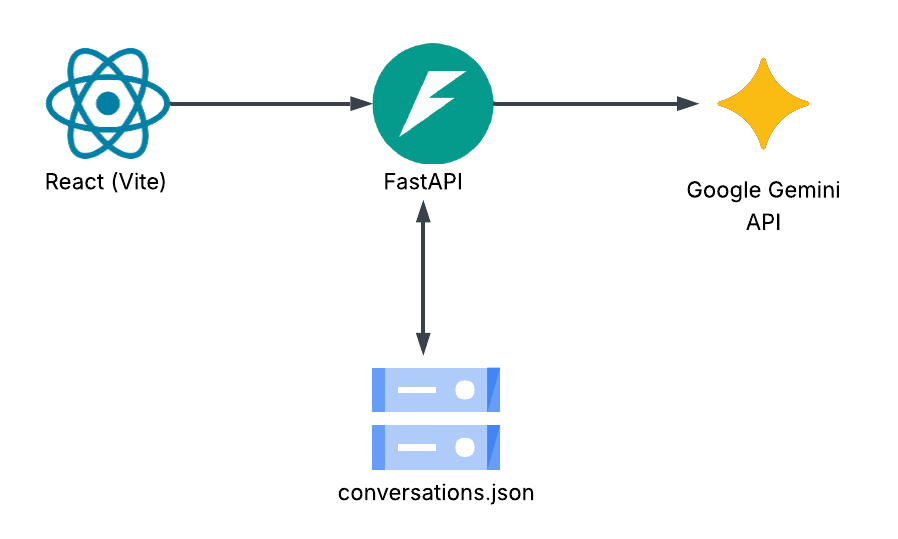

# LLM Chat Demo

A conversational chat application powered by Google's Gemini API, with streaming responses, persistent conversation history, and a session sidebar.

---

## Project Description

LLM Chat Demo is a full-stack web app that lets you have multi-turn conversations with a large language model. Messages stream in token-by-token as they are generated. Conversations are automatically saved after every message and persist across server restarts. A sidebar lists all past sessions, which can be loaded and continued at any time.

The project is based on [the web app integration demo by lassehav](https://github.com/lassehav-oamk/llm-ai-rag-examples/tree/main/9-web-app-integration) with added message memory.

[Project demo video](https://youtu.be/i19Op2KiysI)

---

## Architecture Overview



- **Frontend**: React app (Vite) running on `localhost:5173`. Sends chat messages via HTTP POST and reads the response as a Server-Sent Events stream using the Fetch `ReadableStream` API.
- **Backend**: FastAPI server running on `localhost:8000`. Receives messages, maintains conversation state in memory, streams Gemini responses back to the client using `StreamingResponse`, and persists conversations to a local JSON file.
- **LLM Provider**: Google Gemini (`gemma-4-31b-it`) via the `google-generativeai` Python SDK. The model is called with the full conversation history on every request — there is no server-side session management beyond storing messages.
- **Persistence**: Conversations are saved to `conversations.json` on disk after each assistant reply and loaded back into memory on server startup.

---

## Technical Choices

| Technology | Why |
|---|---|
| **FastAPI** | Async-native Python framework with built-in `StreamingResponse` support. Auto-generates API docs at `/docs`. |
| **Google Gemini (`gemma-4-31b-it`)** | Capable open model available through the Gemini API with support for multi-turn conversation history via the `contents` parameter. Gemma 4 is used due to the 1.5K requests per day available in the free tier. Model can be switched to any Gemini model desired int the backend.|
| **Vite + React** | Fast dev server with HMR. React's state model maps naturally onto a streaming chat UI — each chunk triggers a state update that re-renders only the latest message. |
| **Fetch ReadableStream** | Native browser API for consuming SSE streams without a library. Avoids adding `eventsource` or similar dependencies. |
| **JSON file storage** | Zero-dependency persistence suitable for a capstone/demo. No database setup required. |

---

## Setup and Running Instructions

### Prerequisites

- Python 3.10+
- Node.js 18+
- A Google Gemini API key ([get one here](https://aistudio.google.com/app/apikey))

### 1. Clone the repository

```cmd
git clone <your-repo-url>
cd <repo-name>
```

### 2. Backend setup

Create virtual environment, activate it and install requirements.

```cmd
cd backend
python -m venv venv
venv\Scripts\activate
pip install -r requirements.txt
```

Create a `.env` file in the `backend/` directory:

```
GEMINI_API_KEY=your_api_key_here
```

Start the backend:

```cmd
uvicorn main:app --reload
```

The API will be available at `http://localhost:8000`. Visit `http://localhost:8000/docs` for the interactive API docs.

### 3. Frontend setup

```cmd
cd frontend
npm install
npm run dev
```

The app will be available at `http://localhost:5173`.

---

## Known Limitations

- **No authentication**: There is no user login. Anyone who can reach the server can read all conversations via `/conversations`.
- **Shared conversation store**: All sessions are stored in a single `conversations.json` file with no user separation. In a multi-user scenario, all users' conversations would be mixed together.
- **Sync Gemini call blocks the event loop**: The `google-generativeai` SDK is synchronous. The `generate()` function inside the streaming endpoint is a sync generator, which blocks FastAPI's async event loop while waiting for Gemini. Fine for low traffic, but would need `asyncio.to_thread` or an async SDK for production.
- **No error recovery in the stream**: If the Gemini API throws mid-stream, the client sees the connection close silently with no error message displayed.
- **In-memory store is the source of truth at runtime**: If the server crashes mid-write to `conversations.json`, that message may be lost. A proper database with atomic writes would be needed for reliability.
- **Session IDs are not secret**: Session IDs are randomly generated but not authenticated. A user who knows another session's ID can load it via the API.
- **CORS is hardcoded to `localhost:5173`**: Deploying the frontend to any other origin requires updating the CORS config on the backend.
- **Conversation title is always the first 40 characters of the first message**: There is no smarter titling (e.g. LLM-generated summary).

---

## AI Tools Used

As I am not a web developer and have never before written any React, I used Claude to make necessary changes to the frontend. Claude was also used in formatting this README file.